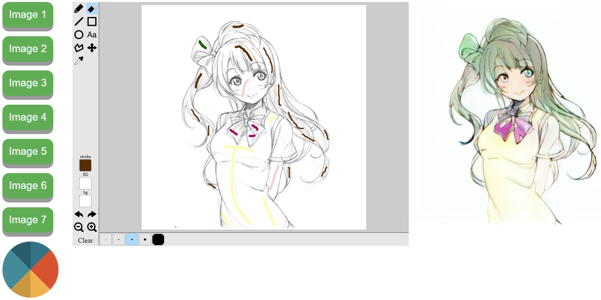

# Introduction
This work is highly inspired by https://paintschainer.preferred.tech/ and http://www.cse.cuhk.edu.hk/~ttwong/papers/colorize/colorize.pdf.  
The goal is to show how easy it is to train your own coloring network by using Pytorch, OpenCV, and the public Danbooru dataset.

# How to use it
1. Clone the repo, then run "python irodoru.py" in command line. Note that you might need to install CUDA and all the missing dependencies, if so, please skip to the next section.
2. Use any browser to open "http://localhost:8080" and start playing!

# Installing the necessary dependencies
1. It's strongly recommended to use a conda environment for running this repo (e.g. https://www.anaconda.com/download/)
1. Download and install CUDA 10 from https://developer.nvidia.com/cuda-downloads
2. To install PyTorch:
   * Windows: conda install pytorch torchvision cuda100 -c pytorch
   * Linux: conda install pytorch torchvision cuda100 -c pytorch
3. For OpenCV: conda install -c conda-forge opencv
4. Use command "pip install flask flask-socketio pillow numpy scipy scikit-learn eventlet" if you miss some of the libraries.

# Preparing the dataset

# Training the models
# Future work
